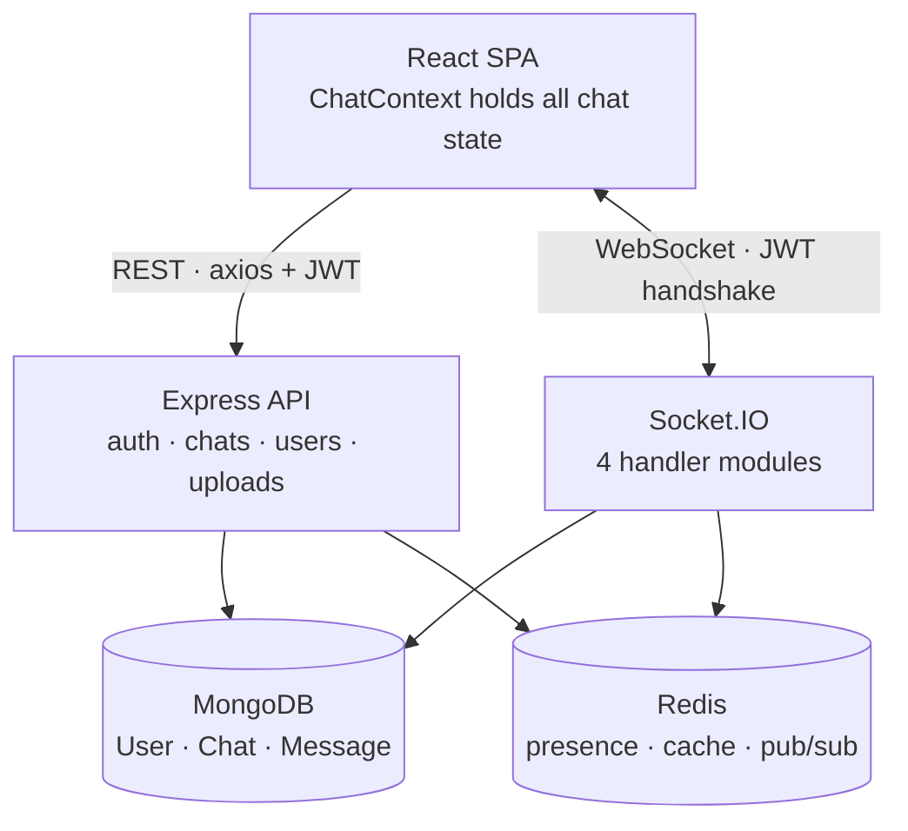

# Real-Time Chat

A full-stack real-time messaging application: one-on-one and group chats, live
delivery and read receipts, typing indicators, presence, file and image sharing,
message editing and deletion, and group administration.

Built with Node/Express + Socket.IO + MongoDB + Redis on the backend and
React 19 + Vite + Tailwind on the frontend.

**[Live demo →](https://real-time-chat-gamma-eight.vercel.app)** — no signup
required; the login page has a one-click guest entry that seeds a few
conversations so the receipt and presence behavior is visible immediately.

## Features

**Messaging**
- One-on-one and group chats, with duplicate one-on-one chats prevented at the
  schema level (`pairKey`)
- Optimistic sending — the bubble appears instantly, then reconciles with the
  server's acknowledgement, and offers a retry if the send failed
- Edit your own text messages within 15 minutes; the window is enforced on the
  server, not just hidden in the UI
- Delete for me (a per-user hide) or delete for everyone (a tombstone that also
  removes the uploaded file from disk)
- Paginated history with load-older-on-scroll

**Realtime**
- Three-state delivery receipts: sent → delivered → read, per participant
- Typing indicators, scoped per chat
- Online/offline presence with last-seen, tracked in Redis
- Silent connection loss detected in ~15s via a tightened heartbeat, with a
  reconnect banner and an automatic resync — messages that arrived while you
  were disconnected appear without a reload
- Server-computed unread counts, so messages received while completely offline
  still show a badge on next load

**Files**
- Image and file attachments up to 10 MB, with an optional caption
- A confirm-before-upload preview screen; nothing is uploaded until you send
- The server decides the message type from the real mimetype — a client-supplied
  type is never trusted

**Chats & users**
- User search to start a chat
- Per-user soft delete, so one person clearing their sidebar never destroys the
  other participant's history
- Group admin actions: rename, change avatar, add and remove members, all
  admin-gated server-side
- Editable profile

---

## Tech stack

| | |
|---|---|
| **Backend** | Node.js, Express 4, Socket.IO 4, Mongoose 8, ioredis, JWT, multer, helmet, winston |
| **Frontend** | React 19, Vite 6, Tailwind 4, React Router 7, axios, socket.io-client, lucide-react, date-fns |
| **Data** | MongoDB (documents), Redis (presence, chat cache, Socket.IO pub/sub adapter) |
| **Testing** | Jest (backend), Vitest + Testing Library + jsdom (frontend) |

Redis is **required**, not an optimization: the Socket.IO Redis adapter is
created during boot, and presence plus the chat cache live there. The server
will not start without it.

---

## Architecture



A few decisions worth knowing before reading the code:

**Two kinds of socket room.** `user-<userId>` is a personal fan-out room, also
used to count a user's open sockets for presence. `<chatId>` is one room per
chat, and every user joins *all* of their chat rooms on connect — not just the
one they are viewing. Broadcasting to a chat room therefore already reaches
every online participant, whatever they happen to have open.

**Presence lives in Redis, not Mongo.** The `User` document has no
`onlineStatus` or `lastSeen` field; both are derived from a Redis socket set.

**Message content is encrypted at rest** with AES-256-CBC and decrypted on the
way out to clients. Decrypted content is never logged.

**One handler contract.** `config/socket.js` builds a single `deps` object
(`io`, `socket`, `logger`, `redis`, the models, the crypto helpers, the cache
invalidator) and passes it to each handler module, which exports exactly one
function that registers its `socket.on` listeners. That indirection is what
makes the realtime layer unit-testable without a live server.

**Message flow for a text send:**

```
socket 'sendMessage'
  └─ participant check → encrypt → Message.save()
       └─ post-save hook updates Chat.latestMessage + invalidates cache
       ├─ 'messageSentAck' to the sender (carries the temp id)
       ├─ 'newMessage' to the chat room (excludes the sender)
       ├─ 'chatRestored' to anyone who had soft-deleted this chat
       └─ delivery receipts for each participant currently online
```

**[ENGINEERING-NOTES.md](ENGINEERING-NOTES.md)** goes further: the full
convention list, per-subsystem implementation notes, and a numbered list of
twelve traps that have each caused a real bug in this codebase — most of them
silent no-ops rather than crashes, which is why they are written down.

---

## Getting started

### Prerequisites

- Node.js 18+
- MongoDB running locally (or an Atlas connection string)
- Redis running locally (or a hosted instance with real pub/sub support)

### Install

```bash
git clone <repo-url>
cd real-time-chat

cd backend  && npm install
cd ../frontend && npm install
```

### Configure

Both sides ship an annotated `.env.example`. Copy each one and fill it in:

```bash
cp backend/.env.example backend/.env
cp frontend/.env.example frontend/.env.local
```

Generate real secrets rather than reusing the placeholders:

```bash
node -e "console.log(require('crypto').randomBytes(48).toString('base64url'))"          # JWT_SECRET
node -e "console.log(require('crypto').randomBytes(24).toString('base64').slice(0,32))" # ENCRYPTION_KEY
```

`ENCRYPTION_KEY` must be **exactly 32 characters** — it is measured in
characters, not hex bytes. It also cannot be rotated on an existing database
without re-encrypting: change it and every stored message becomes undecryptable.

### Run

```bash
cd backend  && npm run dev    # nodemon, port 5000
cd frontend && npm run dev    # Vite dev server, port 5173
```

---

## Environment variables

**Backend** (`backend/.env`)

| Variable | Notes |
|---|---|
| `PORT` | Defaults to 5000. Leave unset on hosts that assign one. |
| `NODE_ENV` | `development` / `production` |
| `MONGO_URI` | URL-encode the password — a literal `@` or `#` silently truncates the string |
| `JWT_SECRET` | Generate fresh; never reuse across environments |
| `JWT_EXPIRES` | e.g. `7d` |
| `ENCRYPTION_KEY` | Exactly 32 characters. Not rotatable — see above |
| `REDIS_HOST` / `REDIS_PORT` / `REDIS_PASSWORD` | Required |
| `REDIS_TLS` | `true` for any hosted provider, empty locally |
| `CLIENT_URL` | The frontend's exact origin, scheme included |
| `DEMO_MODE` | Leave `false` outside the public demo deployment |

**Frontend** (`frontend/.env.local`)

| Variable | Notes |
|---|---|
| `VITE_API_URL` | Backend origin |
| `VITE_SOCKET_URL` | Backend origin |
| `VITE_DEMO_MODE` | Must match the backend's `DEMO_MODE` |

`VITE_*` values are read through `import.meta.env` and baked in at **build**
time — changing them on a host requires a redeploy, not a restart.

`CLIENT_URL` feeds both the Express CORS layer and the Socket.IO handshake, and
is the single most common deployment mistake: set it wrong and the app still
loads and logs in while every request fails as an unexplained network error. A
production boot without it now logs an explicit error at startup.

---

## Scripts

| Command | Backend | Frontend |
|---|---|---|
| `npm run dev` | nodemon `server.js` | Vite dev server |
| `npm start` | `node server.js` | — |
| `npm run build` | — | production build |
| `npm test` | Jest | Vitest (single run) |
| `npm run test:watch` | Jest watch | Vitest watch |
| `npm run lint` | — | ESLint |

---

## Testing

```bash
cd backend  && npm test    # 201 tests, 19 suites
cd frontend && npm test    # 196 tests, 20 files
```

Neither suite needs a live database, Redis, or Socket.IO server. Socket handlers
are tested by injecting a fake `deps` object with stubbed Mongoose chains;
frontend context tests mock the socket and API services, capture the handlers
the context registers, and then "play the server" by invoking them.

Tests live in `__tests__/` directories beside the code they cover. Many of them
encode bugs that were invisible at runtime — silent no-ops rather than crashes —
so each test name is written as a sentence stating an observable behavior.

---

## Project structure

```
backend/
  server.js            bootstrap: connectDB → initializeSocket → listen
  app.js               express app, middleware, routes, error handling
  config/              db, redis, logger, socket, auth middleware, clientOrigin
  models/              User, Chat, Message
  routes/              authRoutes, chatRoutes, userRoutes
  controllers/         auth, chat, user, upload
  socketHandlers/      chatEvents, typingEvents, statusEvents, disconnectEvents
  utils/               encryption, chatAuth, chatCache, presence, uploads, …
frontend/src/
  contexts/            AuthContext, ChatContext (all chat state + socket wiring)
  services/            api.js (axios), socket.js (SocketService singleton)
  pages/ components/ hooks/
```

---

## API

All `/api/users` and `/api/chat` routes require a JWT `Authorization` header.
Rate limits: 5 requests/minute on login and register, 100/minute across `/api`.

| Method | Endpoint | Purpose |
|---|---|---|
| `POST` | `/api/auth/register` | Create an account |
| `POST` | `/api/auth/login` | Log in |
| `POST` | `/api/auth/logout` | Log out |
| `GET` | `/api/users` | Search users |
| `GET` | `/api/users/profile` | Own profile |
| `PUT` | `/api/users/profile` | Update own profile |
| `GET` | `/api/users/:userId/profile` | Public profile |
| `GET` | `/api/chat` | List chats, with unread counts |
| `POST` | `/api/chat/one-on-one` | Create or reopen a direct chat |
| `POST` | `/api/chat/group` | Create a group |
| `GET` | `/api/chat/:chatId` | Chat details |
| `GET` | `/api/chat/:chatId/messages` | Paginated history |
| `DELETE` | `/api/chat/:chatId` | Soft-delete a chat, or leave a group |
| `POST` | `/api/chat/:chatId/upload` | Upload an attachment (10 MB cap) |
| `PUT` | `/api/chat/:chatId/group` | Rename / change avatar (admin) |
| `POST` | `/api/chat/:chatId/participants` | Add members (admin) |
| `DELETE` | `/api/chat/:chatId/participants/:userId` | Remove a member (admin) |

`GET /health` is unauthenticated and touches neither Mongo nor Redis.

Note the HTTP mount is `/api/chat`, singular, while user routes are
`/api/users`.

### Socket events

**Client → server:** `joinChat`, `leaveChat`, `sendMessage`, `editMessage`,
`deleteMessageForMe`, `deleteMessageForEveryone`, `markMessagesAsRead`,
`markChatAsRead`, `messageDeliveredToClient`, `typingStart`, `typingStop`

**Server → client**
- Messages: `newMessage`, `messageSentAck`, `messageEdited`,
  `messageDeletedForMe`, `messageDeletedForEveryone`
- Receipts: `messageDeliveryUpdate`, `messagesReadUpdate`
- Chats: `newChat`, `chatRestored`, `groupUpdated`, `removedFromGroup`,
  `joinedChat`, `leftChatAck`
- Presence & typing: `userStatusUpdate`, `userConnectedToChat`,
  `userDisconnectedFromChat`, `typing`
- Errors: `chatError`, `messageError`, `statusError`

Acknowledgements are separate emit-back events rather than Socket.IO callback
acks, which keeps them broadcastable to a user's other tabs.

---

## Security

- **Messages encrypted at rest** (AES-256-CBC), decrypted only on the way out to
  clients and never written to logs
- **Passwords hashed** with bcrypt; JWT auth on both the HTTP layer and the
  socket handshake
- **Authorization checked per operation, not per session** — every chat action
  re-verifies participation, and group admin routes re-check the admin id. A
  missing or forbidden chat both answer 404, so the API never reveals which
  chats exist
- **helmet** security headers, CORS restricted to one exact origin, and rate
  limiting on auth and API routes
- **`trust proxy` set to exactly one hop** rather than trusting the whole chain,
  so a client cannot forge `X-Forwarded-For` to get its own rate-limit bucket
- **Upload hardening:** the participant check runs *before* multer, so a denied
  upload never touches disk; files are stored under random hex names with the
  original filename kept only as metadata; anything not on an inline-safe
  extension whitelist is served `Content-Disposition: attachment`; and SVG is
  deliberately classified as a file rather than an image, since it is the one
  image format that can carry scripts

---

## Deployment

See **[DEPLOY.md](DEPLOY.md)** for a complete free-tier walkthrough (Render +
Vercel + MongoDB Atlas + Redis Cloud), including the ordering problem — the
backend needs the frontend's URL and vice versa — and the failure modes that are
quiet enough to waste an afternoon on.

## Current limitations

- Profile avatars are URLs, not uploads, even though file upload infrastructure
  exists and could be reused
- Uploaded files are written to the instance's local disk, so they do not survive
  a redeploy on an ephemeral host; persistent storage would mean moving to S3 or
  similar
- Messages are held in memory for the active chat only, with no per-chat cache,
  so switching chats always refetches
- The socket service dispatches through a single callback slot per event name,
  so each server event supports exactly one client-side consumer

---

**Author:** Mehmet Samet Gok

**License:** ISC
